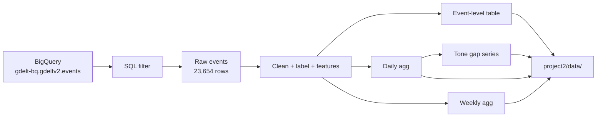

# Project 2 Data Pipeline

This is how our GDELT data pipeline works. Everything lives in `project2/data_collection.py` — it's basically one straight ETL flow: pull from BigQuery, clean and label, aggregate, then save 4 files for the dashboard.



---

## 1. Extract — pull from BigQuery

We query the public GDELT v2 table `gdelt-bq.gdeltv2.events`. Auth goes through our GCP service account (configured in `project2/.env`).

The SQL in `build_gdelt_query()` filters down to rows that match **all** of these:

| Filter | What we keep |
|--------|--------------|
| Time | `SQLDATE` from Feb 1 to Apr 30, 2025 (`20250201`–`20250430`) |
| US–China | Actor1 and Actor2 involve USA and CHN (either direction) |
| Event type | CAMEO codes for diplomacy, criticism, threats, sanctions, etc. (roots `01,02,11,12,13,16,17,18`) |

Important: each row is one **GDELT event**, not one news article. GDELT parses news into structured political events. We pull actors, CAMEO codes, tone (`AvgTone`), conflict score (`GoldsteinScale`), coverage counts (`NumArticles`, `NumMentions`), geo fields, and `SOURCEURL`.

When we ran it, we got **23,654 events** back into a pandas DataFrame. We use `create_bqstorage_client=False` because our service account doesn't have the BigQuery Storage API permission — standard download works fine, just a bit slower.

---

## 2. Transform — clean and enrich each event

We run these steps in order on the raw DataFrame:

**Dates** (`clean_date_fields`)
- Turn `SQLDATE` into proper dates: `Date`, `DateStr`, week fields (`WeekStr`, `WeekStart`)
- Parse `DATEADDED` into `DateAdded`

**Countries & direction** (`clean_country_fields`)
- Fill missing country codes with `"UNK"`
- Add `EventDirection`: `USA→CHN` or `CHN→USA` based on who is Actor1 vs Actor2
- Add `ActionCountry` from where the event happened geographically

**Source domain** (`clean_source_fields`)
- Parse `SOURCEURL` → `SourceDomain` (e.g. `yahoo.com`, `scmp.com`)

**Media group labels** (`label_media_groups`)
- Match each domain against two lists in `data_collection.py`:
  - `WESTERN_MEDIA_DOMAINS` → `"Western"` (US/UK/EU/AU/CA outlets + high-volume domains from our GDELT pull, e.g. yahoo.com, theepochtimes.com, newsweek.com)
  - `CHINESE_STATE_MEDIA_DOMAINS` → `"Chinese"` (PRC state media, embassy sites, HK/China-region outlets like scmp.com, english.news.cn)
  - anything else → `"Global/Other"`
- Subdomain matching works too — `finance.yahoo.com` counts as Western if `yahoo.com` is on the list
- After expanding the lists (based on our Feb–Apr 2025 data), expected split is roughly **5,500 Western / 770 Chinese / 17,400 Global/Other** — re-run the pipeline to refresh the saved files

**Dashboard features** (`engineer_dashboard_features`)
- `EventSentiment` from `GoldsteinScale` (cooperative / conflictual / neutral)
- `ToneCategory` from `AvgTone` (positive / negative / neutral)
- Human-readable event labels from CAMEO codes
- `CoverageIntensity` = log of article count

This gives us the main event-level table → `gdelt_events_cleaned.parquet/csv`

---

## 3. Transform — build aggregated tables

From the cleaned events we build 3 more tables, each for a different chart in the dashboard:

**`daily_aggregates`** — grouped by date + media group
- Event counts, article/mention/source totals
- Tone stats (mean, min, max, std) plus article-weighted `WeightedTone`
- Used for timeline charts

**`weekly_aggregates`** — grouped by week + country + media group
- Weekly counts and average tone/Goldstein per country
- Used for map/geo views over time

**`tone_gap_series`** — built from the daily table
- Pivots Western vs Chinese weighted tone per day
- `ToneGap = WesternTone − ChineseTone` (positive means Western coverage is more positive than Chinese)
- Used for divergence / forecasting views

---

## 4. Load — save to `project2/data/`

| File | What one row represents | What we use it for |
|------|---------------------------|-------------------|
| `gdelt_events_cleaned` | 1 event | Detail views, filters, drill-down |
| `daily_aggregates` | 1 day × media group | Timelines |
| `weekly_aggregates` | 1 week × country × media group | Maps |
| `tone_gap_series` | 1 day | Western–Chinese tone gap |

We save both `.parquet` (for the Shiny app) and `.csv` (easier to inspect manually).

---

## What our numbers actually mean

From our pipeline run:

- **23,654 events** — tariff-relevant US–China GDELT events in the 3-month window. Not 23k articles.
- **2,959 unique domains** — lots of different news sources; after expanding our Western/Chinese lists, about **23%** of events get a Western or Chinese label (up from ~8% before)
- **~50/50 USA→CHN vs CHN→USA** — roughly balanced by who initiated the event.
- **Top domains** (yahoo.com, theepochtimes.com, etc.) — yahoo and epoch times are now labeled Western; Indian/Southeast Asian outlets (timesofindia, straitstimes) stay in `Global/Other` on purpose

---

## How to run it

Everything goes through `run_pipeline()` in `data_collection.py`:

```python
client = bigquery.Client(project=PROJECT_ID)
df_raw = query_gdelt_events(client)

df = clean_date_fields(df_raw)
df = clean_country_fields(df)
df = clean_source_fields(df)
df = label_media_groups(df)
df = engineer_dashboard_features(df)

daily_agg = create_daily_aggregates(df)
weekly_agg = create_weekly_aggregates(df)
tone_gap = create_tone_gap_series(daily_agg)
```

After the first run, we don't need BigQuery again — `load_processed_data()` just reads the parquet files from `project2/data/`.